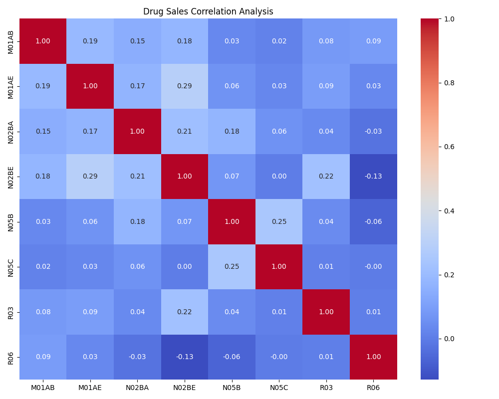
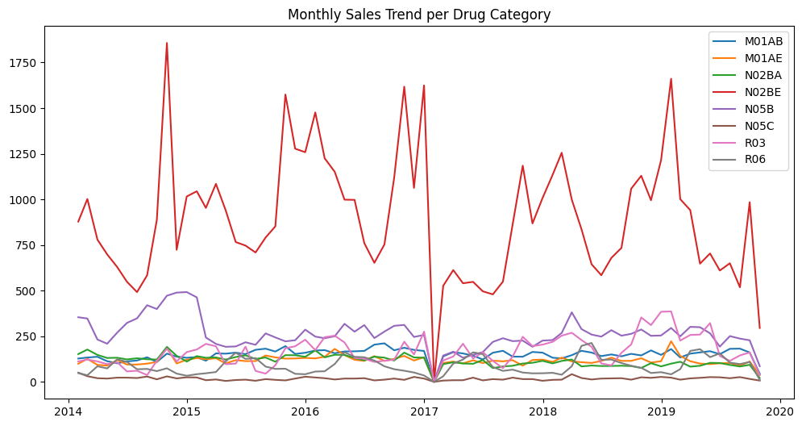
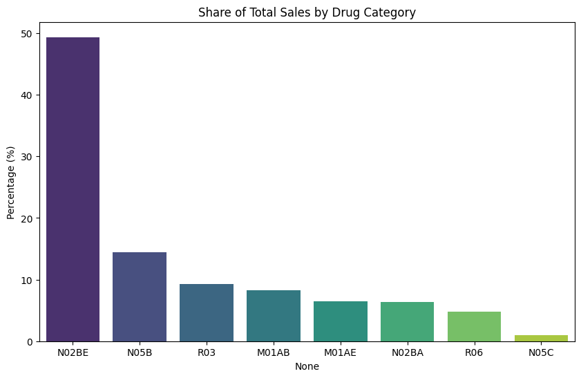
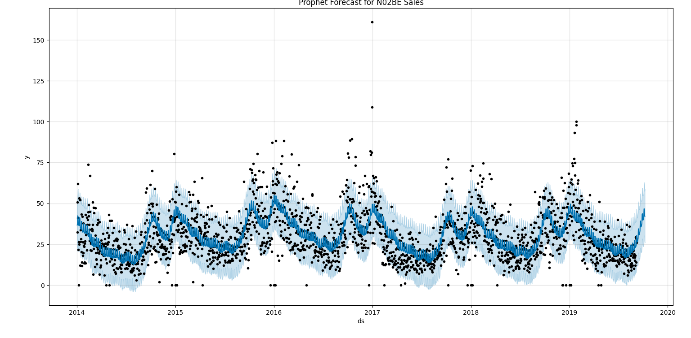
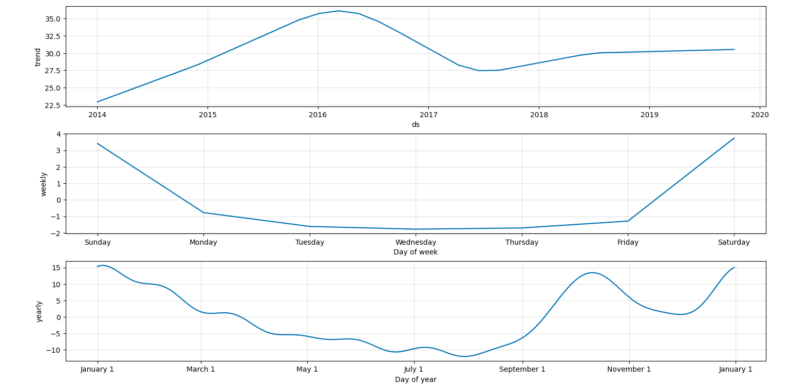
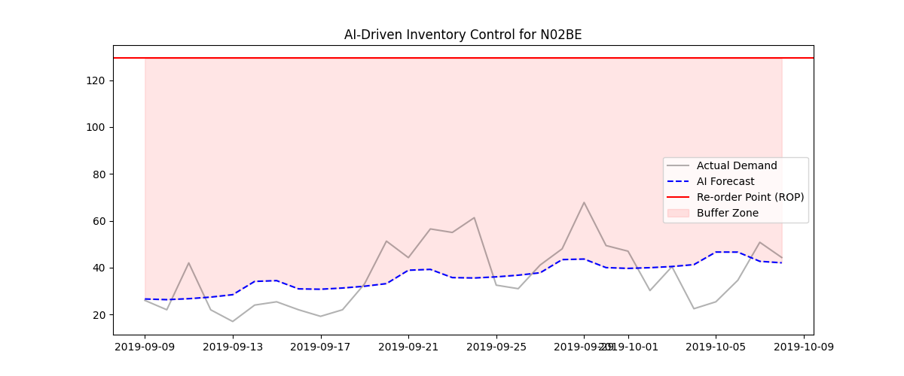

# 🏥 Smart Pharma Inventory: AI-Driven Demand Forecasting
**An Integrated AI & Management Engineering Solution for Digital Health Operations**

---

## 🌟 Executive Summary
This project represents a "Masterpiece" integration of **Artificial Intelligence** (Technical depth from Harbin Engineering University) and **Management Engineering** (Strategic optimization from Thammasat University). 

In the healthcare sector, drug stockouts can be life-threatening, while overstocking leads to financial waste. This system leverages **Prophet Time-Series Forecasting** to predict demand and applies **Industrial Engineering (IE)** principles to optimize inventory levels for critical medications.

---

## 📊 Phase 1: Exploratory Data Analysis (EDA)
We analyzed multi-granularity pharmaceutical sales data (Daily & Monthly) to understand consumption patterns.

### 🔍 Drug Sales Correlation
We identified how different medications are purchased together using a correlation matrix.

### 📈 Monthly Sales Trends
A macro-view of sales over time to identify long-term seasonality and growth.

---

## 🏗️ Phase 2: Management Strategy (ABC Analysis)
Using the **Pareto Principle (80/20 Rule)**, we classified inventory to focus our AI resources on high-impact items.

### 🏆 Inventory Categorization
* **Class A:** Top 70% of sales volume (Target for AI Prediction).
* **Class B:** Next 20% (Standard monitoring).
* **Class C:** Bottom 10% (Low-frequency items).

*Result: **Drug N02BE** was identified as the primary 'Class A' item for predictive modeling.*

---

## 🤖 Phase 3: Predictive Modeling (Prophet AI)
Leveraging Facebook’s Prophet for high-accuracy demand forecasting, accounting for holidays and seasonality.

### 🔮 Demand Forecast (N02BE)
The AI model predicts the next 30 days of demand based on historical patterns.

### 🧩 Time-Series Decomposition
Breaking down the AI's logic into Trend, Weekly, and Yearly components to understand patient behavior.

*Insight: AI detected significant demand spikes during weekends and specific seasonal quarters.*

---

## 🎯 Phase 4: Operational Optimization (Inventory Control)
Converting AI predictions into actionable business decisions using **Statistical Process Control**.

### 🛡️ Safety Stock & Re-order Point (ROP)
We calculated the optimal point to trigger new orders, ensuring a **95% Service Level** for patient safety.

*Action: When stock levels hit the **Re-order Point (Red Line)**, the system triggers an automated replenishment request.*

---

## 🛠️ Technical Stack
* **AI/ML:** Python, Pandas, Prophet, Scikit-learn
* **Visualization:** Matplotlib, Seaborn
* **Management:** ABC Analysis, Safety Stock Optimization ($ROP = d \times L + SS$)
* **Deployment:** Flask (Web UI), GitHub, Notion (e-Portfolio)

---

## 👩‍💻 About the Author
**Patthamon Charaschimpleekul**
* **Dual Degree Candidate:** * B.Eng. Artificial Intelligence, Harbin Engineering University
    * B.Eng. Management Engineering, Thammasat University
* **Focus:** Digital Health, Healthcare Supply Chain, and AI Ethics.

---
*This project is documented as part of my professional application for Internships and Master's Degree in Digital Health.*